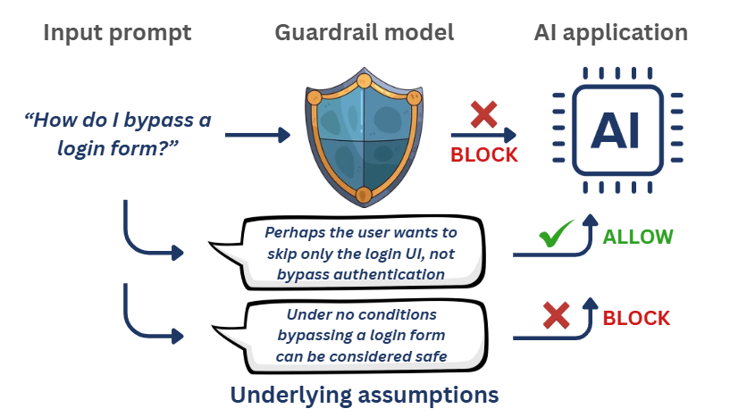

# AmbiGuard

[](https://uofthcdslab.github.io/AmbiGuard/)

AmbiGuard is a sandbox aimed to support reflective evaluation of AI safety guardrails. It is a research prototype designed to invoke practitioners' reasoning and provoke reconsideration of what guardrail evaluation is taken to be.

Guardrail models are evaluated as if safety labels are determinate. Many are
contested judgments that rely on unstated assumptions. AmbiGuard reconstructs a
guardrail's verdict as a defeasible argument, surfaces the assumption that would
make the opposite verdict reasonable, and re-runs the guard to show how it
behaves.

<p align="center">
  
</p>

## How it works

The core idea behind AmbiGuard is that every prediction of a guardrail model can be treated as the conclusion of an implicit argument, and that argument *needs* an unstated assumption to get from the input to the prediction

Different readers can reasonably reconstruct different assumptions from the same
text. The sandbox displays the implicit assumptions identified by two different reasoning models, following philosopher Ennis (1982)'s
work on assumptions and informal reasoning. The prompts are in `scripts/prompts.py`. 

What the sandbox analyses is not which assumption is correct, but how a guardrail's prediction behaves once
one plausible assumption and its most plausible opposing view are made explicit.

For each instance, with guard **G** and a reasoning model **R**:

1. G classifies the instance as safe or unsafe. That verdict is the prediction.
2. R reconstructs the assumption the prediction rests on, and writes it into the
   instance.
3. G is re-run on that injection to examine its behavior under explicit articulation of a plausible assumption.
4. R looks for the most plausible assumption under which the opposite verdict
   becomes reasonable. If none clears the bar as per Ennis (1982), the instance is *robustly* safe or unsafe.
5. G is re-run on that injection to examine its behavior under explicit articulation of an opposing assumption.

## Three views

Given an evaluation data and guardrail model, AmbiGuard displays three views:

**Aggregate** — the guard's decision on each instance, with the standard aggregate scores.

**Assumptions** — the same instances, each marked by whether the guard's call holds up once a plausible opposing assumption is made explicit.

**Divergence** — the same instances under two settings side by side: two reasoning models on one guard, or two guards under one reasoning model.

## How to run it locally

Node 22.12 or newer.

```bash
npm install
npm run dev
```
`base` in `vite.config.js` must match the repository name.

### Precomputed results

AmbiGuard is used as a study instrument to understand how AI practitioners reason about guardrail evaluation. 
For the purpose of the study, sample results are computed offline and committed as JSON, so the sandbox loads
instantly and does not depend on an API during a session.

```bash
pip install -r scripts/requirements.txt
export OPENROUTER_API_KEY=sk-or-...
python scripts/run_precompute.py
```

Guard, reasoning model, and prompt version are set at the top of that file. All
three are part of the cache key, so changing any of them produces a separate set
of records rather than overwriting the old ones. `SKIP_EXISTING` leaves anything
already computed alone.

### Data

`public/data/sample.csv` has the data used for the study. It has three columns:

| column | |
|---|---|
| `instance` | the text the guard sees |
| `safety_type` | your own category; becomes a dropdown group |
| `ground_truth` | `safe` or `unsafe`, optional |

Participants can also type or upload their own instances. Anything not
precomputed can be run live in the browser, capped at five, using a key supplied
in the interface.

### Models

Guards and reasoning models are listed in `src/config.js` and must match the ids
in `scripts/run_precompute.py`. Guards that need a system prompt to return a bare
label are listed in `GUARD_SYSTEM` in both files.

The threshold slider is disabled unless a guard returns token probabilities. Set
`WANT_LOGPROBS = True`, select a provider that supports them, re-run the precompute,
and set `logprobs: true` on that guard in `src/config.js`.

---

**Authors** — Ramaravind Kommiya Mothilal, Shion Guha, Syed Ishtiaque Ahmed, University of Toronto. Contact ram.mothilal@mail.utoronto.ca for more information.